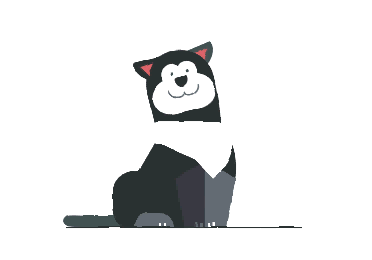

<h1 align="center">
    
</h1>

## :clipboard: About the project

Decides to recreate this project that became extremely famous by applying new concepts and colors, in addition to reinforcing my knowledge in preprocessors

## :computer: Languages used

* Sass

## :book: Licença

This project is under the MIT license. See the [LICENSE](LICENSE.md) for more details.